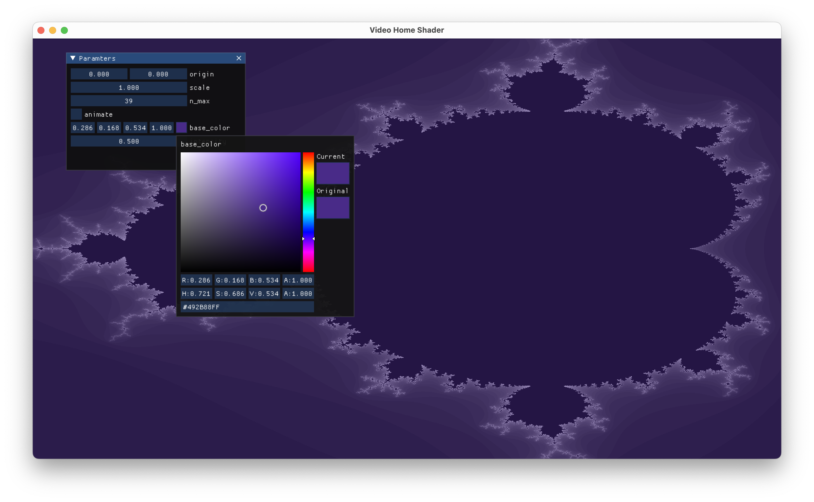

# VHSh

_Video Home Shader_: A demo tool for digitally assisted analog vjaying




## Setup

Create a virtual environmenet and install the dependencies

```bash
python3.10 -m venv .venv
source .venv/bin/activate
pip3 install -r requirements.txt
```

Then run `VHSh` fron that environment

```bash
source .venv/bin/activate
python3 vhsh.py mandelbrot.glsl
```

You can pass `--watch` to automatically reload the shader upon file change.

If you're seeing a message like

> 2024-10-02 22:10:15.567 Python\[75271:1828570\] ApplePersistenceIgnoreState: Existing state will not be touched. New state will be written to /var/folders/2b/gfpmffr15n9cwdy6_44mhy8r0000gn/T/org.python.python.savedState

run the following to get rid of it:

```bash
defaults write org.python.python ApplePersistenceIgnoreState NO
```

To [fix type checking][imgui-issue-stubs] on `imgui`, download [this stubs file][] and
place it in this directory.


## Writing Shaders for _Video Home Shader_

_Video Home Shader_ supplies you with a 2D canvas to draw into using an OpenGL
_fragment shader_. It is run once for every pixel on the screen and determines
it's color.

Berfore your shader file is run, a preamble is prepended to the source code.
It defines

> OpenGL Version 330 core

so you just need to supply a `main` function and set the output color `FragColor`
as an RGBA `vec4` with floats between 0 and 1 (`0., 0., 0., 1.)` being black).

```glsl
void main() {
    FragColor = vec4(0.8, 0.2, 0.2, 1.0);
}
```

### Builtin Parameters

You can use the following built-in parameters, that are pre-defined in the
preamble:

- `vec2 u_Resolution`: width and height of the window in pixels. This can
  be used to calculate normalized screen space coordinates like
  ```glsl
  vec2 pos = gl_FragCoord.xy / u_Resolution;
  ```
  where `pos.xy` will now have the current pixel's coordinates between
  `[-1, 1]^2`
- `float u_Time`: Seconds since the program start. This can be used to animate
  things. For example
  ```glsl
  vec4 color = vec4((sin(2. * 3.14 * u_Time * ) + 1.) / 2., 0., 0., 1.);
  ```
  will create a red pulsing effect with one pulse per second.


### Custom Parameters

You can define custom parameters to vary directly in the code, and the user
interface to manipulate them will be generated automatically. Use the `uniform`
keyword followed by a type (`bool`, `int`, `float`, `vec2`, `vec3`, `vec4`) and
a name.

```glsl
uniform bool override_red; // =False
uniform int n_max; // =10 [1,200]
uniform float scale; // =1. [0.,2.]
uniform vec2 origin; // =(0.,0.) [-2.,-2.]
uniform vec3 dir; // =(1.,0.,0.) [-1.,-1.]
uniform vec4 base_color; // <color> =(1.,1.,0.,1.)
```

Using a special syntax in a comment on the same line, you can define the
default value `=VALUE`, range `[MIN,MAX,STEP]` (where `STEP` is optional),
and `<WIDGET>` to indicate a special UI widget  (`<color>` on `vec4` for
RGBA color picker).

The have to be defined in the order

```glsl
uniform type name; // <WIDGET> =VALUE [MIN,MAX,STEP]
```

and the values (and ranges) may not contain whitespace. Each individual part
(widget, value, range) is optional and they can be mixed and matched as
desired, as long as the order of appearance is correct. As generally with
GLSL, it is also important to strictly match the types. Supplying a `float`
as default value for an `int` will not work. There may be no other text in
the comment. All vector types have to be supplied as a comma-separated list
of floats, enclosed by parentheses (`(1.,2.,3.)`). One can only supply a
scalar range that applies along all dimensions.

```glsl
// syntax error
uniform float scale; // =1
// OK
uniform float scale; // =1.

// syntax error
uniform vec2 origin; // =[0.,0.]
// OK
uniform vec2 origin; // =(0.,0.)

// syntax error
uniform vec3 dir; // [[0.,1.],[0.,1.],[0.,5.]]
// OK
uniform vec3 dir; // [0.,1.]
dir.z *= 5;
```


## TODO

- [x] render fragment shader over the whole screen
- [x] load shader from file
- [x] auto-generate tuning ui for uniforms
- [x] auto-define builtin uniforms / math library / preamble
- [x] hot reload https://watchfiles.helpmanual.io/api/watch/
- [x] define defaults and ranges in uniform definition as comment
- [ ] fix file watch thread stop
- [ ] widget size and close button
- [ ] re-parse metadata on reload
- [ ] write current values to file
- [ ] select different shaders
- [ ] imgui display shader compile errors
- [ ] 60fps cap / fps counter
- [ ] save and load different presets (toml in the shader file?)
  ```toml
  [mapping]
  # mapping uniforms to MIDI addresses
  n_max = 0x23
  color = 0x42
  # mapping preset ids to MIDI addresses
  "@1" = 0xa1
  "@2" = 0xa2

  [[uniforms.n_max]]
  type = "int"
  value = 25
  min = 0
  max = 100

  [[uniforms.color]]
  type = "color"
  value = [1.0, 1.0, 1.0]
  min = [0.0, 0.0, 0.0]
  max = [1.0, 1.0, 1.0]

  [[presets.1]]
  n_max = 10
  color = [0.0, 1.0, 0.75]

  [[presets.1]]
  n_max = 5
  color = [1.0, 1.0, 1.0]
  ```
- [ ] split into runtime and imgui viewer
  - maybe just have option to show or hide the controls as separate window
  - https://github.com/ocornut/imgui/wiki/Multi-Viewports
  - https://github.com/ocornut/imgui/blob/docking/examples/example_glfw_opengl2/main.cpp
- uniforms
  - [x] time
  - [ ] mouse
  - [ ] prev frame
  - [ ] audio fft
  - [ ] video in
- [ ] raspberry pi midi or gpio support


## Resources

- https://pyopengl.sourceforge.net/documentation/manual-3.0/
- https://regex101.com
- https://github.com/pyimgui/pyimgui/blob/master/doc/examples/testwindow.py
- https://pthom.github.io/imgui_manual_online/manual/imgui_manual.html
- https://iquilezles.org/articles/
- https://docs.gl/sl4/


[imgui-issue-stubs]: https://github.com/pyimgui/pyimgui/issues/364
[imgui.pyi]: https://raw.githubusercontent.com/denballakh/pyimgui-stubs/refs/heads/master/imgui.pyi
